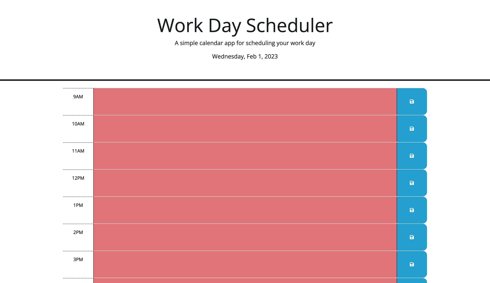

# Work Day Scheduler
#### Daniel Hernandez
 

## Technologies Used
<ul>
    <li>HTML</li>
    <li>CSS</li>
    <li>Javascript</derli>
</ul>    

 

## Description
This website shows users a list of times for a regular work day. In this website, the time of day is tracked with the dayjs() method and each block with a time associated with it will change their color dynamically to show whether or not it is in the present, past, or future.

 

## Installation
 

https://danalexanderh.github.io/calendar-application/

 

## Usage
This application can have users make a plan for a regular scheduled work day. By adding text to each block that is represented with a time, the user can click the save button and have their text be stored in the local storage as well persist when they reload or close the application
   

